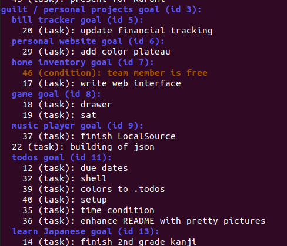

# todos

Rust-based CLI todos tracker based on a dependency tree of todos (or rather, a dependency DAG of todos). Only shows you the leaves unless you ask it to overwhelm you.

The idea behind this project is to show you only the tasks on your list that you can complete at the moment. It is to help clear one's mind of the things they must do but are waiting on a condition or the completion of another task.



## Requirements

- `git`
- `cargo` / `rust` toolchain

## Setup:

- *nix / MacOS:
  1. Clone the repo
  2. Whenever you want to update, `cd` into the repo and run `update_or_install.sh` 

- Windows
  1. Clone the repo
  2. Read `update_or_uninstall.sh`
  3. Whenever you want to update, try to do the same thing `update_or_uninstall.sh` does manually! :)

Configure console colors (more configurations coming soon) in `~/.todos/config.toml`. Supports basic ANSI color codes (i.e. bold blue "01;94", RGB orange "38;2;255;127;0").

## Types of Nodes

There are three types of nodes:

- `goal`: always shown when displaying todos. Acts as a sort of category or long-term goal. Used for grouping todos. Can be nested.
  - (i.e. "work", "college", "personal projects", "being a responsible person", etc.)
- `condition`: used to indicate something you're waiting on -- something you cannot do, only tell when it's done
  - (i.e. "Jeff has messaged me back", "It's August", etc.)
- `task`: an actionable todo

## Usage:

- show todos:
```bash
todos
```
or, to only display nodes that are an indirect dependency of another
```bash
todos under [id of indirect parent]
```
Add the flag `--overwhelm` (or, equivalently, `-o`) to show all the todos, not just the leaves.
- `add` command:
```bash
todos add [node type (optional, default is "task")] "[description]"
```
or to go ahead and add the node to a parent,
```bash
todos add [node type (optional, default is "task")] "[description]" to [id of direct parent to be]
# or
todos add [node type (optional, default is "task")] "[description]" under [id of direct parent to be]
```

or to insert a node as the direct parent of another,
```bash
todos add [node type (optional, default is "task")] "[description]" above [id of direct child to be]
```
- `complete` command:
```bash
todos complete [id of completed node]
```
Operates recursively, completing subtasks as well.
- `link` command: for if you want a node you've already added to depend on or be depended on by another node.
```bash
todos link [id of direct parent to be] [id of direct child to be]
```
- `unlink` command: for if you change your mind about the structure of your dependency DAG.
```bash
todos unlink [id of direct parent] [id of direct child]
```

- `edit` command: to change the description of a node.
```bash
todos edit [id of node] [new description]
# or 
todos relabel [id of node] [new description]
```

## Disclaimer

Contains mildly insulting messages. :)

## Upcoming changes
- a shell...?
- deadlines
